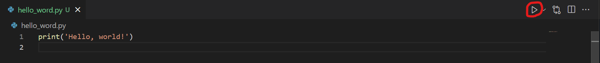
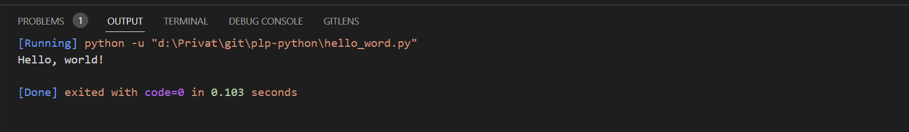

# PLP Python Tutorial

## Setup and installation

### Windows setup:
 Follow the instructions according to this [How to Install Python on Windows 10](https://www.digitalocean.com/community/tutorials/install-python-windows-10).

### Linux setup:
Should be installed by default. Otherwise follow the instruction on [Installing Python 3 on Linux](https://docs.python-guide.org/starting/install3/linux/)
### MacOS setup:
Follow the instructions according to this [Install Python on MacOS](https://www.jcchouinard.com/install-python-on-macos/#:~:text=The%20best%20place%20to%20install,to%20start%20the%20Python%20installer.). 

### Note: Make sure you installed pip along python!

### Git setup:
In case you have never used git, here is a quick setup which is needed in order to install and run git on your local machine. Git is a type of version control that helps you to organize and manage your code for projects and we recommend using it all the time for all languages. Instructions are [here](https://git-scm.com/book/en/v2/Getting-Started-Installing-Git).

## Clone the repository
Clone and install the repository which is needed to follow along our tutorial. Simply head over to this [link](https://github.com/Chreggii/plp-python) and select the code button on the right. Then, copy the repository either through ssh or https and clone it locally on your machine. For this, open up the terminal of your choice and head to the selected folder you want to clone the repository to, then type the command **git clone "git repo url"**. 

### Install dependencies
Once it is installed, simply head to the created folder by using the **cd** command.
Once you are in the root folder, run the command **-r requirements.txt** to install the necessary dependencies for our exercises. 

Note: We will write into the teams chat when the git pull is ready and then you can install the dependencies from the repository.

## IDE
We propose to use [VS Code](https://code.visualstudio.com/) or [Pycharm](https://www.jetbrains.com/de-de/pycharm/) as IDE.

### Recommended Python VS Code Extensions
- [Python](https://marketplace.visualstudio.com/items?itemName=ms-python.python)
- [Pylance](https://marketplace.visualstudio.com/items?itemName=ms-python.vscode-pylance)

## Run "Hello World" in VS Code

1. Create a file named `hello_world.py` with the content `print('Hello, world!')`
2. Run the code by pressing the "Run Code" button (It requires that the extensions have been installed). 
3. You should now see the output on the bottom of VS Code. 

